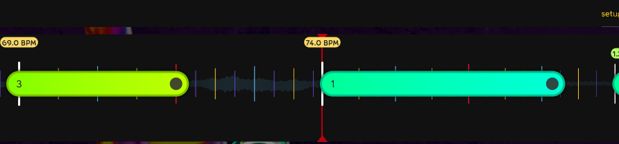

# UniBeat - Rhythm Engine

~ Created by Marcus Robinson ~

A reactive, event-driven rhythm engine for Unity3D designed to be used in any sort of rhythm game.

UniBeat allows you to easily define your own rhythm game rules and UniBeat handles the processing of user input, the scoring, music playback and more.

Inspiration for UniBeat came from [Osu!](https://github.com/ppy/osu). I wanted to build something similar to the core Osu! engine, but which would be easy to extend, compatible with Unity3D and use a reactive programming model.

# Key Concepts

## The Timeline
The timeline is the primary data structure of UniBeat. It is a list of events, with each event having an index. Events are emitted by the timeline as its playhead moves from the start to the end.

You will typically supply a list of events to the timeline by deserializing a JSON string using the static method `JsonLoadedTimelineData.Load()`

## Events
Your timeline will emit events as the playhead moves. All game functionality is driven by events. A hitobject that the player needs to hit is an event, as is the trigger to start the music or to play a sound effect.

## Tempo Events
The most important and tricky concept to learn. Tempo Events (TE's) represent a change in BPM within the song. They do not represent the song's offset (the time before the first beat), but the song offset is inferred from the first TE that comes after the song's start event.

### Tempo Event Indexes and Offsets
Tempo Events don't have a normal relationship to indexes because they can occur at any point in the song. If you were making a level editor, TE's wouldn't snap to indexes - they would just have an "offset" value because even if your granularity of indexes was down to 1/64th of a beat, you still might have a TE that occurs BETWEEN two indexes. And since the occurrence of an TE always signifies the existence of a new integer index, this means that TE's have the ability to cut beats short and exist outside the constraints of snapping.

In short, Tempo Events don't snap to indexes - they ARE indexes. That is, they represent the 0th index of a new tempo and determine where indexes should be placed and how far apart they should be.

### Cutting Beats Short
Tempo Events don't play by the rules of indexes, since they may appear at any point in the timeline and may cut short an existing beat. To illustrate,  imagine the scenario represented in the image below - the song is playing at 69BPM and then before the final beat of the section is finished, it changes to 74BPM. When a new TE appears on the timeline, it always represents the presence of an index position and all subsequent events falling within its domain will snap to the beat duration that it defines.

In this example, what is the index of the 74BPM TE? Is it a fractional value in relation to where it falls to the 69BPM TE? Or is it an integer value representing the New World Order of beat duration that it defines for its subsequent beats? The answer is confusingly - BOTH. Both of these indexes (relative and absolute) are used in the code base and are represented on the TE as `IndexRelativeToPriorBPM` and `Index`.

The `IndexRelativeToPriorBPM` is primarily required for us to know when the clock needs to fast forward and emit the `Index` value of this new TE that we've just encountered.

### The Default Tempo Event
Songs usually have some silence or ambience in the track prior to the first beat of the song occuring. This means that the first TE will have a non-zero offset, leaving us with a no-man's land prior to this first TE ocurring. No-man's land is not acceptable - EVERY part of the timeline needs to be represented by an TE so that we know how fast/slow beats move. This is enforced in `TimelineData.Validate()`, and to ensure this is always the case, a "Default" TE is always injected at the start of the timeline.

The Default TE (`TempoEvent.Default`) is inserted at the very beginning (index: 0, offset: 0ms) of every timeline to ensure we have a BPM representation at every index. If the Timeline data provides its own TE at offset 0ms, then the default TE is removed (see `TimelineData.RemoveDefaultTempoIfNotRequired`), so as to not conflict.

# Audio Playback
Right now, the only supported audio playback library is FMOD, however it's easy to add support for other libraries if you want to. Check out the [Listeners/Sound](./Source/Core/Listeners/Sound) folder to see how the FMOD implementation is done.